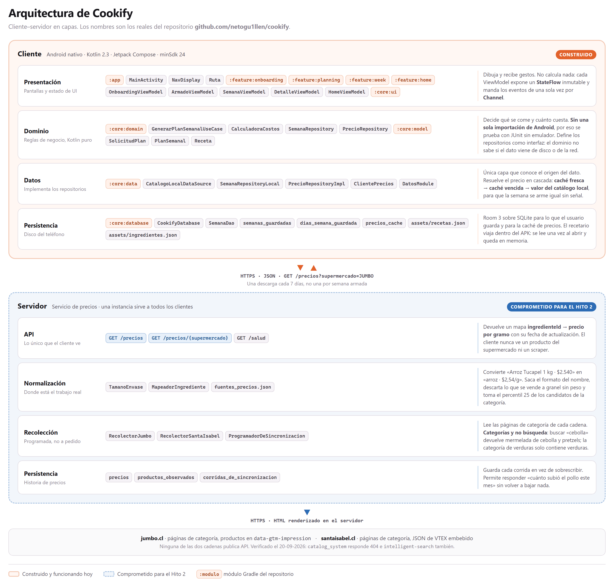

# Arquitectura de Cookify



Cookify es una aplicación **cliente–servidor en capas**. El cliente es una app Android
nativa que hoy funciona completa y sin red; el servidor es un servicio de precios que se
construye en el Hito 2 y que ya está justificado con mediciones propias.

La regla que ordena el diseño: **cada capa solo conoce la que tiene debajo, y el dominio
no conoce a ninguna**. `:core:domain` no tiene una sola importación de Android, así que el
motor de planificación se prueba con JUnit en la JVM, sin emulador y en milisegundos.

---

## Las capas del cliente y de qué responde cada una

| Capa | Módulos Gradle | De qué responde | De qué **no** responde |
|---|---|---|---|
| Presentación | `:app`, `:feature:*`, `:core:ui` | Dibujar y recibir gestos | No calcula precios ni elige recetas |
| Dominio | `:core:domain`, `:core:model` | Qué se come y cuánto cuesta | No sabe si el dato viene de disco o de red |
| Datos | `:core:data` | Resolver de dónde sale cada dato | No decide reglas de negocio |
| Persistencia | `:core:database`, `assets/` | Guardar y leer | No transforma nada |

El dominio define `SemanaRepository` y `PrecioRepository` como **interfaces**, y `:core:data`
las implementa. Esa inversión es la que permite que el Hito 2 agregue el servidor **sin
tocar el motor de planificación**: cambia quién responde el precio, no quién lo usa.

---

## Caso de uso recorrido: «armar mi semana»

Es el recorrido completo del producto. Sigue el camino de un toque hasta la pantalla final.

**1 · Presentación** — El usuario contesta siete pasos. `OnboardingViewModel` guarda cada
respuesta en un `SavedStateHandle` (sobrevive a que Android mate el proceso) y valida en
cada paso si `puedeAvanzar`. Al terminar emite por un `Channel` el evento
`EventoOnboarding.Listo(SolicitudPlan)`.

> `SolicitudPlan` es el contrato entre capas: supermercado, personas, días, presupuesto,
> antojos, restricción y artefactos. Nada más cruza hacia abajo.

**2 · Presentación** — `MainActivity` navega a `Ruta.Armado(solicitud)`. La ruta lleva la
solicitud y una semilla, **nunca el plan ya construido**: así la navegación se serializa
barata y el plan se reconstruye igual en cualquier momento.

**3 · Dominio** — `ArmadoViewModel` llama a `GenerarPlanSemanalUseCase(solicitud, semilla)`,
que ejecuta cuatro pasos sobre las 69 recetas:
filtra por restricción y por artefactos disponibles → puntúa cada receta según los antojos
pedidos → selecciona sin repetir plato ni abusar de una misma proteína → ajusta a
presupuesto. Es **determinista**: misma semilla, mismo plan.

**4 · Datos** — El motor pide el catálogo a `CatalogoLocalDataSource`, que lee
`recetas.json` e `ingredientes.json` una sola vez al abrir la app y los deja en memoria.
Son de solo lectura, así que no pasan por Room.

**5 · Datos → Red** *(Hito 2)* — Para cada ingrediente, `PrecioRepositoryImpl` resuelve el
precio en cascada:

```
caché fresca (< 7 días)  →  caché vencida  →  valor de ingredientes.json
```

Si hay red y la caché venció, `ClientePrecios` pide `GET /precios?supermercado=JUMBO` **en
segundo plano** y guarda el resultado en la tabla `precios_cache`. El respaldo al catálogo
local no es opcional: **sin él no se puede armar una semana sin señal**.

**6 · Dominio** — `CalculadoraCostos` escala cada ingrediente por el número de personas y
**redondea hacia arriba lo que se vende por unidad**: media palta no existe en el
supermercado, y el presupuesto tiene que cobrar la palta entera que el usuario va a pagar.

**7 · Presentación** — El motor termina en milisegundos, así que `ArmadoViewModel`
escenifica cuatro verificaciones de ~750 ms que nombran los datos reales del usuario. Si el
presupuesto no alcanza, la secuencia se detiene en la etapa que falló y ofrece el mínimo
viable calculado. Al terminar emite `EventoArmado.Listo(solicitud, semilla)`.

**8 · Persistencia** — Al tocar «Guardar semana», `SemanaRepositoryLocal` escribe en Room a
través de `SemanaDao`, en dos tablas con borrado en cascada. Se guarda **el plato de cada
día, no la semilla**: si mañana cambia el catálogo, la semana guardada no muta.

**9 · Presentación** — `HomeViewModel` observa `repositorio.observar(): Flow<List<SemanaGuardada>>`.
La portada se actualiza sola, sin que nadie le avise.

---

## Por qué hay un servidor

La decisión no salió de un requisito académico sino de una medición. Se comparó el precio
de los **17 productos idénticos** presentes el mismo día en Jumbo y en Santa Isabel: la
diferencia va de **−9,1% a +57,4% según el producto, no según la cadena**. No existe un
multiplicador por supermercado, así que el precio hay que **medirlo**, no estimarlo.

Medido el costo de hacerlo desde el teléfono:

| | Peso comprimido | Tiempo |
|---|---|---|
| Una categoría de Jumbo | 302 KB | 2,8 s |
| Una búsqueda de Santa Isabel | 41 KB | 1,1 s |
| **Un refresco completo** | **6–9 MB** | **10–20 s** |

Tres razones para que eso viva en un servidor y no en cada teléfono:

1. **Costo por cliente.** 6–9 MB por usuario contra una sola descarga que sirve a todos.
2. **Fragilidad.** Cuando la cadena cambia su sitio, se cae un servicio que se arregla en
   una tarde; no una app instalada que necesita pasar por Play.
3. **Cortesía de red.** Un servicio consulta una vez cada varias horas; mil teléfonos
   consultando es otra cosa.

## Decisión de renderizado

El cliente es **nativo, no web**. El equivalente móvil de la discusión entre página única y
multipágina es **una sola Activity con navegación declarativa** (`NavDisplay` de
Navigation3) frente a varias Activities. Se eligió la primera: el estado del onboarding
vive en un solo `ViewModel` y las transiciones entre los siete pasos no pierden lo ya
respondido. El costo asumido es que toda la navegación depende de una librería en versión
1.1.4, todavía joven.
